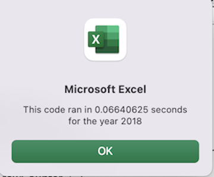

# Excel and Macros in VBA

## Overview of Project
We are tryingIn this project, we are helping Steve, run analysis on all stocks provided in green_stocks.xls sheet using macros. However for this task we are also refactoring the macro that we previously wrote to run analysis on all stocks for sheets "2017" and "2018", such that it takes lesser time to run analysis on all stocks.

### Results

#### Time taken for analysis 2017

  
   

 
    

Above are the images of time taken to compelete analysis for 2017 all stocks between original code and refactored code. 
Refactored code takes much lesser time to complete.

Let us look at the difference now for 2018

#### Time taken for analysis 2018

  
   

We see a similar pattern here, refactored code took much lesser time than the original code.

